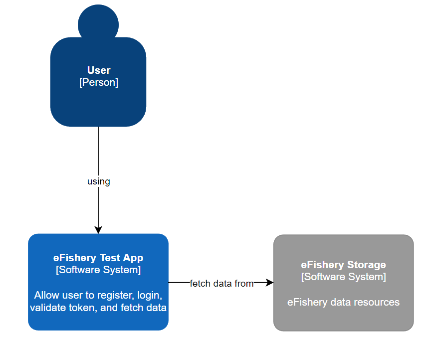
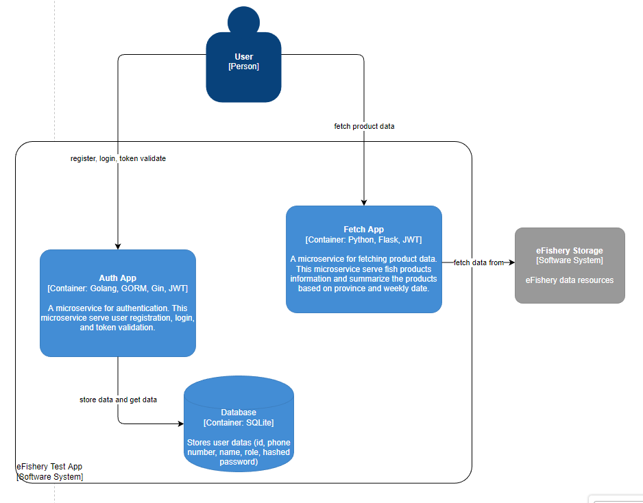

# eFishery Test
Repository for storing eFishery Backend Engineer Test assignments.  
There are two apps in this repository, namely `auth app` and `fetch app`.

## Auth App
A microservice for authentication. This microservice serve user registration, login, and token validation.

### Requirements
Meet the following requirements if you want to run this application locally:
- Golang 1.18+
- Docker and Docker Compose

### Setup
Make sure you are in the `auth` folder. Create `.env` file by copying from `example.env` and set the environment variables.

### Run
You can run the app natively or using docker compose. To run the app natively, please execute the bash commands bellow:
```bash
go mod tidy
go run main.go
```
To run the app using docker compose, make sure that the port specified in `docker-compose.yml` is same as defined in `.env` . After that, please execute the bash commands bellow:
```bash
docker compose up -d
```
At this point, the `auth` app should be running.

## Fetch App
A microservice for fetching product data. This microservice serve fish products information and summarize the products based on province and weekly date.

### Requirements
Meet the following requirements if you want to run this application locally:
- Python 3.8+
- PIP 22+
- Docker and Docker Compose

### Setup
Make sure you are in the `fetch` folder. Create `.env` file by copying from `example.env` and set the environment variables.

### Run
You can run the app natively or using docker compose. To run the app natively, please execute the bash commands bellow:
```bash
pip install -r requirements.txt --no-cache-dir # one time only to install required library
flask run
```
To run the app using docker compose, make sure that the port specified in `docker-compose.yml` is same as defined in `.env` . After that, please execute the bash commands bellow:
```bash
docker compose up -d
```
At this point, the `fetch` app should be running.
## Run Auth & Fetch App in One Step
Make sure you are in the root folder of this repository and execute the bash commands bellow:
```bash
docker compose up -d
```
## API Documentation
The API are documented in Postman.
[eFishery (getpostman.com)](https://documenter.getpostman.com/view/12345457/VUqsqw6P)

## C4 Model (Context & Deployment/Container)

### Context Level


<br/>

### Deployment/Container Level


## Video Demo Application
You can watch demo app on youtube 
[Demo eFishery Test](https://youtu.be/TZIy5REHLWc)

## Deployed App
All apps are deployed to Heroku.

Auth : [http://efishery-test-auth.herokuapp.com](http://efishery-test-auth.herokuapp.com/)
Fetch : [http://efishery-test-fetch.herokuapp.com](http://efishery-test-fetch.herokuapp.com/)